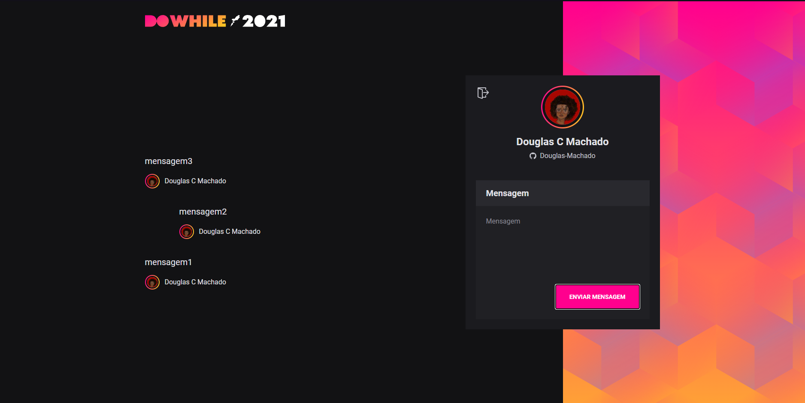

# NLW Heat Web

## Sobre

Utilizando a API node para cadastrar usuários e mensagens utilizando react.js

### Uso

* `npm install` ou `yarn` para adicionar as dependencias

* `yarn dev` para utilizar o projeto

### Reminder

Será necessário estar com a API node rodando para fazer o uso completo da aplciação

link: https://github.com/Douglas-Machado/nlw-heat-impulse
